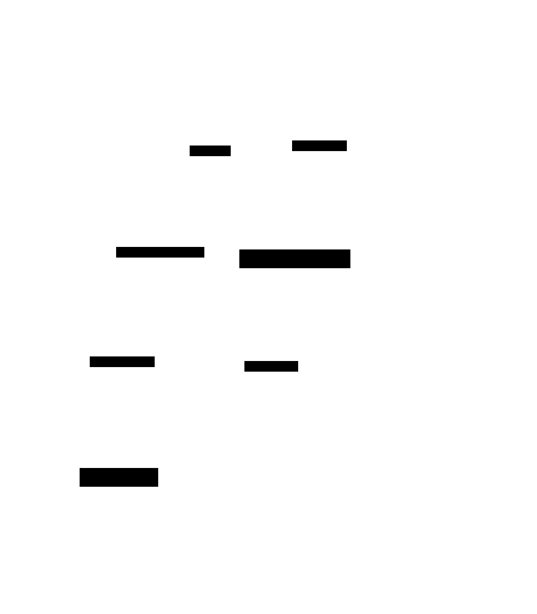

# Content Generator

A silly project for showcasing [hexagonal architecture](https://ericcbonet.com/posts/hex-architecture-and-chat-gpt_part-1/) in golang, and having AI create worthless content for social media. See the example twitter post below.

## How it works

